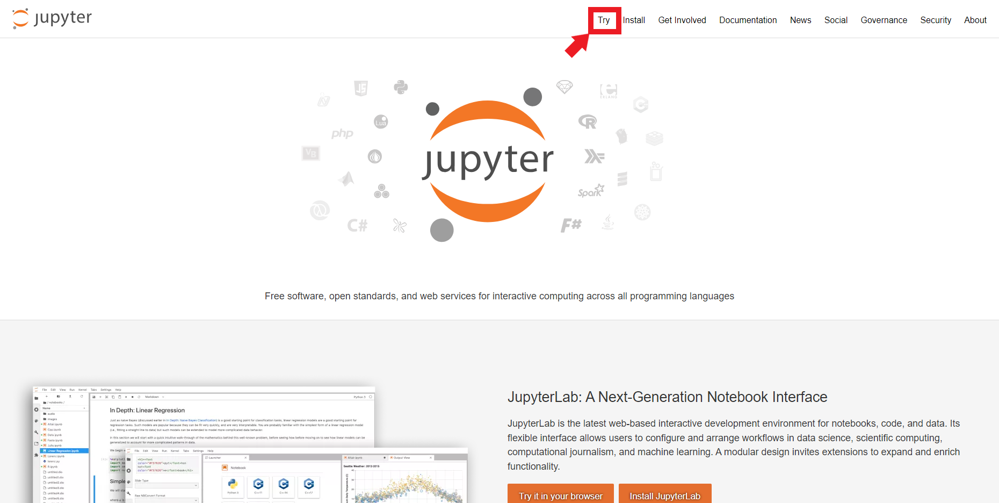
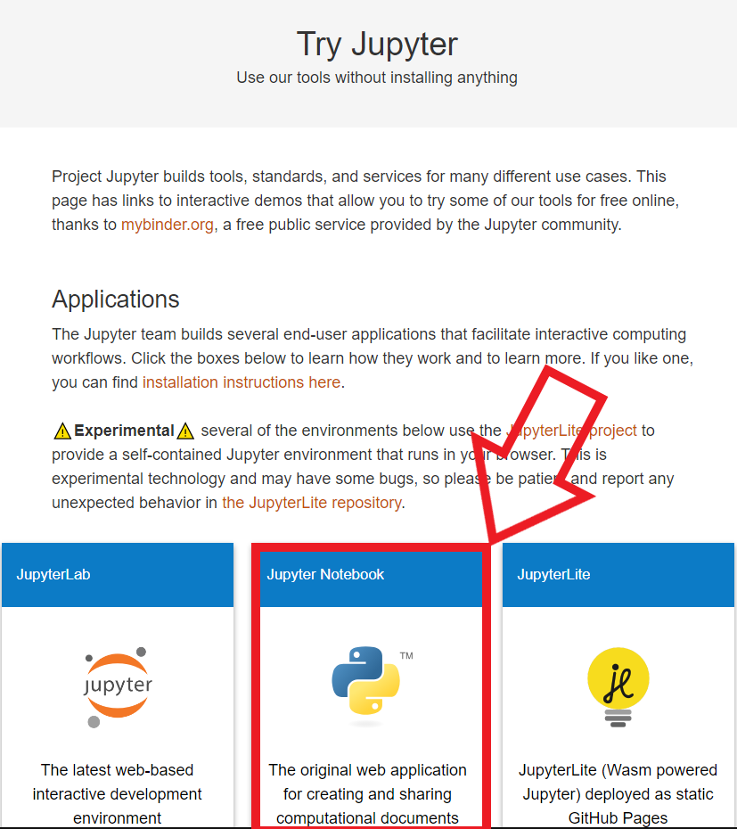
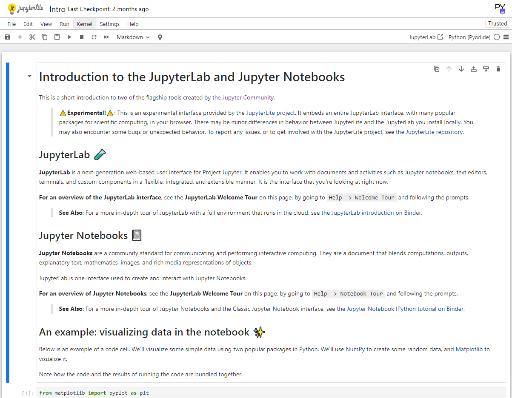
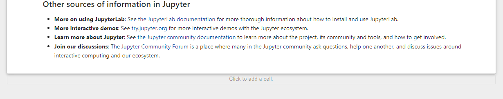
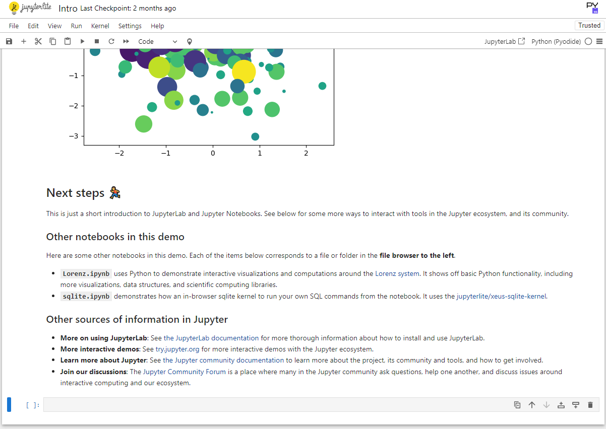
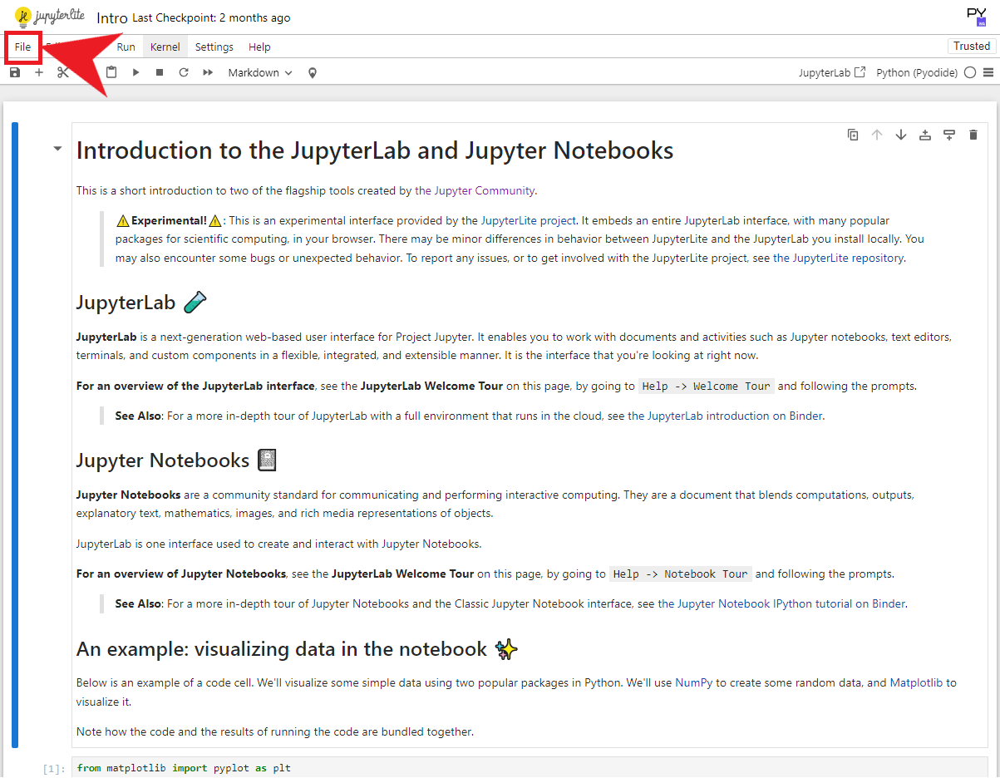
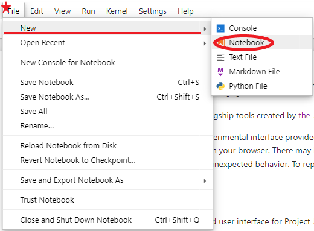
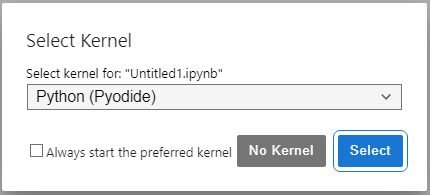
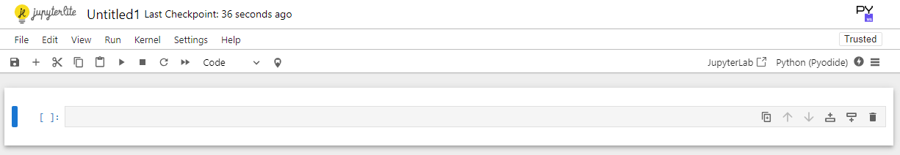

## Requisitos para atender el curso:

### Conocimientos básicos:
- **Uso básico de una computadora:** Saber manejar carpetas, archivos y utilizar programas como un navegador web.
- **Nociones de inglés (opcional):** Muchas palabras clave en Python y documentación están en inglés, aunque no es indispensable, es útil para aprovechar recursos adicionales.

---
### Equipamiento Necesario:
- **Computadora:** Con acceso a internet y capacidad para instalar Python.
- **Sistema operativo:** Windows, macOS o Linux (Python es compatible con todos).
- **Editor de texto o IDE:** Como:
  - [Visual Studio Code](https://code.visualstudio.com)
  - [PyCharm](https://www.jetbrains.com/pycharm/)
  - [Jupyter Notebook](https://jupyter.org)(¿[Cómo comenzar a usar Jupyter?](#cómo-comenzar-a-usar-jupyter)).
- Instalar [Python](Python.org)

---
### Actitudes y Disposición:
- **Ganas de aprender:** La motivación es clave para adentrarte en la programación.
- **Paciencia:** Como todo aprendizaje nuevo, puede haber retos iniciales.
- **Resolución de problemas:** Disposición para analizar y buscar soluciones.

---
### ¿Cómo comenzar a usar Jupyter?

Para poder comenzar a usar Jupyter debemos acceder al enlace proporcionado anteriormente([Jupyter](https://jupyter.org))

**Paso 1:**

Ahora, al acceder al enlace obtendremos acceso al siguiente sitio:

Como indica la flecha necesitamos dar click en el apartado "TRY" para poder comenzar a utilizar Jupyter.

**Paso 2:**

Al dar click, accederemos a la siguiente sección para poder elegir en que modalidad utilizaremos Jupyter:

Utilizaremos la modalidad de Jupyter notebook, la cual nos dará acceso a una interfaz donde serémos capaces de comenzar a codificar en python.

**Paso 3:**

Nos mostrarán un poco de información de introducción a lo que es JupyterLab y Jupyter Notebooks, si lo desean pueden continuar con la lectura de esta información para poder utilizarla en un futuro.

**Paso 4:**

Esta plataforma nos permite escribir el código y ejecutarlo por campos(celdas), en donde podremos escribir las líneas de código que necesitemos, pero antes de comenzar a escribir debemos generar dichos campos, de la siguiente manera:

Al final de la nota introductoria por parte de Jupyter, tendremos el pie de la página, en esta sección podremos encontrar un botón escondido que solo se revelará al pasar nuestro cursor por el borde inferior de lo anterior descrito, el cual contendrá un texto "**Click to add a cell**", ahí es donde daremos click y se nos agregará una celda en la cual podremos comenzar a escribir nuestro código.

De esta forma, también podremos generar un archivo nuevo para poder ejecutar código desde cero.

Accesando a la barra de herramientas en la parte superior, podremos encontrar un botón que dirá "**File**".

En el podremos accesar a las opciones de "archivo" para generar o editar aspectos que vayamos a requerir.

Pero a nosotros nos interesará la parte de crear un archivo nuevo, por lo tanto nos dirigiremos a la parte de "**New**" y "**Notebook**".

Por último nos pedirá que seleccionemos el kernel, por practicidad lo dejaremos en la opción que aparece en la imágen, y continuaremos dando click sobre el botón "**Select**".

Y listo, podremos comenzar a escribir nuestro código, más información durante el lapso del taller.
